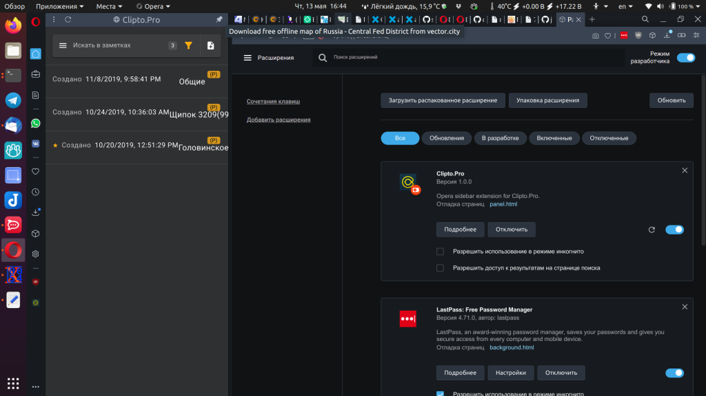

# Sidebar entry for Clipto.Pro

Read the [book](https://dev.opera.com/extensions/sidebar-action-manual/), Luke!

And take a look at [opera-extension-sidebar-boilerplate](https://github.com/da2x/opera-extension-sidebar-boilerplate)

## Install

1. Clone the repo
1. Go to "Extension manager"
1. Turn on "Developer mode"
1. Press "Load unpacked extension"
1. Navigate to the `extension` subfolder in your clone of the repo
1. Press "Open"

## Установка

1. Клонировать репу
1. Перейти в браузере в "Расширения" (иконка — "кубик")
1. Включить "Режим разработчика"
1. Нажать "Загрузить распакованное расширение"
1. Войти в папку `extension` внутри клонированной репы
1. Нажать "Открыть"

# EOF #
<!-- vim:set ft=markdown ai et ts=4 sts=4 sw=4 cc=80: -->
